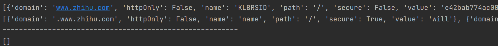

# Selenium

```python
from selenium import webdriver
from selenium.webdriver.common.by import By
from selenium.webdriver.common.keys import Keys
from selenium.webdriver.support import expected_conditions as EC
from selenium.webdriver.support.wait import WebDriverWait

browser = webdriver.Chrome()
try:
    browser.get('https://www.baidu.com')
    input = browser.find_element_by_id('kw')
    input.send_keys('Python')
    input.send_keys(Keys.ENTER)
    # wait = WebDriverWait(browser, 10)
    # wait.until(EC.presence_of_element_located((By.ID, 'content_lef')))
    print(browser.current_url)
    print(browser.get_cookies())
    print(browser.page_source)
finally:
    browser.close()
```

* 初始化浏览器对象

  ```python
  from selenium import webdriver
  browser = webdriver.Chrome()
  ```

* 访问页面

  ```python
  from selenium import webdriver
  browser = webdriver.Chrome()
  browser.get('https://www.baidu.com')
  print(browser.page_source) #  打印页面源代码
  browser.close()
  ```

* 查找单个节点

  ```python
  # browser.find_element
  from selenium import webdriver
  
  browser = webdriver.Chrome()
  browser.get('https://www.taobao.com')
  input_first = browser.find_element_by_id('q')
  # 等价于browser.find_element(By.ID, 'q')
  input_second = browser.find_element_by_css_selector('#q')
  input_third = browser.find_element_by_xpath('//*[@id="q"]')
  print(input_first, input_second, input_third)  # 都是WebElement类型 三个一致
  ```

* 查找多个节点

  ```python
  # browser.find_elements
  from selenium import webdriver
  from selenium.webdriver.common.by import By
  
  browser = webdriver.Chrome()
  browser.get('https://www.taobao.com')
  lis = browser.find_elements(By.CSS_SELECTOR, '.service-bd li')
  print(lis)
  ```

* 节点交互
  send_keys 输入文字、clear 清空文字、 click 点击按钮

  ```python
  from selenium import webdriver
  from selenium.webdriver.common.by import By
  import time
  
  browser = webdriver.Chrome()
  browser.get('https://www.taobao.com')
  _input = browser.find_element(By.ID, 'q')
  _input.send_keys('iPhone')
  time.sleep(1)
  _input.clear()
  _input.send_keys('iPad')
  button = browser.find_element(By.CLASS_NAME, 'btn-search')
  button.click()
  ```

* 动作链

  ```python
  from selenium import webdriver
  from selenium.webdriver import ActionChains
  from selenium.webdriver.common.by import By
  
  browser = webdriver.Chrome()
  url = 'http://www.runoob.com/try/try.php?filename=jqueryui-api-droppable'
  browser.get(url)
  browser.switch_to.frame('iframeResult')
  source = browser.find_element(By.CSS_SELECTOR, '#draggable')
  target = browser.find_element(By.CSS_SELECTOR, '#droppable')
  actions = ActionChains(browser)
  actions.drag_and_drop(source, target)
  actions.perform()
  ```

* 运行JavaScript
  有些操作Selenium没有提供API，如下拉进度条。这种情况可以模拟运行JavaScript。

  ```python
  from selenium import webdriver
  
  browser = webdriver.Chrome()
  browser.get('https://www.zhihu.com/explore')
  browser.execute_script('window.scrollTo(0, document.body.scrollHeight)')
  browser.execute_script('alert("To Bottom")')
  ```

* 获取节点信息
  通过page_source属性获取网页的源代码后可以通过解析库(bs4、re、lxml)从中提取信息。Selenium也提供了提取节点信息的方法

  WebElement类：
  get_attribute 获取节点属性，text属性获取节点内部文本信息
  id属性获取节点ID、location获取节点在页面相对位置
  tag_name获取标签的名称

  ```python
  from selenium.webdriver.common.by import By
  from selenium import webdriver
  
  browser = webdriver.Chrome()
  browser.get('https://taobao.com')
  logo = browser.find_element(By.CLASS_NAME, 'logo-bd')
  print(logo)
  print(logo.get_attribute('href'))
  ```

  ```python
  from selenium.webdriver.common.by import By
  from selenium import webdriver
  
  browser = webdriver.Chrome()
  browser.get('https://taobao.com')
  div = browser.find_element(By.CSS_SELECTOR, '#J_SiteNavMytaobao > div.site-nav-menu-hd > a > span')
  print(div)
  print(div.text)
  ```

* 切换Frame
  网页中有一种节点叫做iframe，也就是子Frame
  Selenium打开一个页面后默认在父Frame里操作，若想获取子Frame里的节点，需要使用switch_to.frame(frame_name)方法切换Frame
  使用switch_to.parent_frame()可以切换回父Frame

* 延时等待
  Selenium中，get方法在网页框架加载结束后才会结束执行，若我们尝试在get方法执行完毕时获取网页源代码，结果可能并不是浏览器完全加载完成的页面，因为某些页面有额外的Ajax请求，页面还会由JS渲染。所以需要设置浏览器延时等待一定时间，来确保节点已经加载

  ```python
  from selenium import webdriver
  from selenium.webdriver.common.by import By
  from selenium.webdriver.support import expected_conditions as EC
  from selenium.webdriver.support.wait import WebDriverWait
  
  browser = webdriver.Chrome()
  browser.get('https://www.taobao.com')
  wait = WebDriverWait(browser, 10) # 设置等待时间为10s
  _input = wait.until(EC.presence_of_element_located((By.ID, 'q')))
  button = wait.until(EC.element_to_be_clickable((By.CSS_SELECTOR, '.btn-search')))
  print(_input, button)
  ```

* 前进和后退
  forward方法和back方法

  ```python
  from selenium import webdriver
  import time
  
  browser = webdriver.Chrome()
  browser.get('https://www.taobao.com')
  browser.get('https://www.baidu.com')
  browser.get('https://www.jd.com')
  browser.back()
  time.sleep(1)
  browser.forward()
  time.sleep(1)
  browser.close()
  ```

* Cookie

  ```python
  from selenium import webdriver
  
  browser = webdriver.Chrome()
  browser.get('https://www.zhihu.com/explore')
  print(browser.get_cookies())
  browser.add_cookie({'name': 'name', 'domain': 'www.zhihu.com', 'value': 'will'})
  print(browser.get_cookies())
  browser.delete_all_cookies()
  print("===================================================")
  print(browser.get_cookies())
  ```

  

* 选项卡管理

  ```python
  from selenium import webdriver
  import time
  
  browser = webdriver.Chrome()
  browser.get('https://www.baidu.com')
  browser.execute_script('window.open()')
  print(browser.window_handles)
  browser.switch_to.window(browser.window_handles[1])
  browser.get('https://www.taobao.com')
  time.sleep(1)
  browser.switch_to.window(browser.window_handles[0])
  browser.get('https://www.jd.com')
  ```

* 反屏蔽
  很多网站增加了对Selenium的检测以反爬，若检查到有人使用Selenium打开浏览器就直接屏蔽
  检测的基本原理是检测当前浏览器窗口下的windows.navigator对象中是否包含webdriver属性。正常使用浏览器时，这个属性应该是undefined
  使用execute_script调用js把webdriver属性置空？此时页面已经加载完毕，为时过晚。

  可以使用CDP（Chrome Devtools Protocol，Chrome开发工具协议）
  利用它可以实现在每个页面刚加载的时候就执行js语句。

  ```python
  from selenium import webdriver
  from selenium.webdriver import ChromeOptions
  
  option = ChromeOptions()
  option.add_experimental_option('excludeSwitches', ['enable-automation'])
  option.add_experimental_option('useAutomationExtension', False)
  browser = webdriver.Chrome(options=option)
  browser.execute_cdp_cmd('Page.addScriptToEvaluateOnNewDocument', {
      'source': 'Object.defineProperty(navigator, "webdriver", {get: ()=>undefined})'
  })
  browser.get('https://antispider1.scrape.center/')
  ```

* 无头模式

  ```python
  from selenium import webdriver
  from selenium.webdriver import ChromeOptions
  
  option = ChromeOptions()
  option.add_argument('--headless')
  browser = webdriver.Chrome(options=option)
  browser.set_window_size(1366, 768)
  browser.get('https://www.baidu.com')
  browser.get_screenshot_as_file('preview.png')
  ```

  
