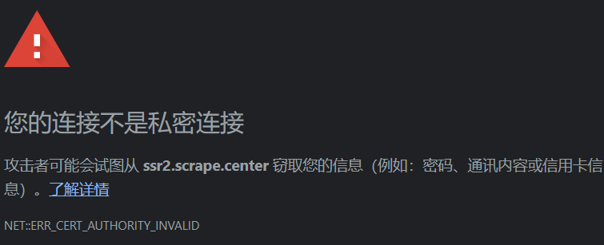

# 一、requests库

1. 抓取json

```python
import requests

url = 'https://www.httpbin.org/get'
params = {
    'name': 'will',
    'age': 18
}
r = requests.get(url=url, params=params)
print(r.text)  # <class 'str'>
print(r.json()['url']) # <class 'dict'>
# json方法将JSON格式字符串转为字典
# 若返回结果不是JSON格式会出现解析错误
```

```python
import requests
import json

data = {
    'name': 'will',
    'age': 18
}
headers = {
    'User-Agent': '',
    'Content-Type': 'application/json'
}
r = requests.post('https://www.httpbin.org/post', data=json.dumps(data))
print(r.text)
```

2. 抓取网页

```python
import requests
import re

r = requests.get('https://ssr1.scrape.center/')
pattern = re.compile('<h2.*?>(.*?)</h2>', re.S)
titles = re.findall(pattern, r.text)
print(titles)
# ['霸王别姬 - Farewell My Concubine', '这个杀手不太冷 - Léon', '肖申克的救赎 - The Shawshank Redemption'.....]
```

3. 抓取二进制数据

```py
import requests

r = requests.get('https://scrape.center/favicon.ico')
with open('favicon.ico', 'wb') as f:
    f.write(r.content)
```

4.文件上传

```python
import requests
files = {
    'file': open('favicon.ico', 'rb')
}
r = requests.post('https://www.httpbin.org/post', files=files)
print(r.text)
```

* 设置cookie

```python
import requests

r = requests.get('https://www.baidu.com')
for key, value in r.cookies.items():
    cookie = key + '=' + value
    print(key + '=' + value)
headers = {
    'Cookie': cookie
}
```

可直接在请求头里面添加cookie

* 维持session

```python
import requests

s = requests.Session()
s.get('https://www.httpbin.org/cookies/set/number/123666')
r = s.get('https://www.httpbin.org/cookies')
print(r.text)
```

* SSL证书验证

  现在许多网站要求使用HTTPS协议，但有些网站没有设置好HTTPS证书，或者网站的HTTPS证书不被CA机构认可，这些网站就可能出现SSL证书错误的提示
  
  而若用requests库来请求这类网站同样会报错 SSLError
  使用verify参数控制是否验证这个数

  ```python
  import requests
  import urllib3
  
  urllib3.disable_warnings() // 设置忽略警告
  r = requests.get('https://ssr2.scrape.center/', verify=False)
  print(r.status_code)
  ```

* 超时设置

  timeout 参数

* 身份认证
  auth参数

  ```py
  import requests
  from requests.auth import  HTTPBasicAuth
  
  r = requests.get('https://ssr3.scrape.center/', auth=HTTPBasicAuth('admin', 'admin'))
  print(r.status_code)
  ```

  requests库还提供了其他认证 如OAuth认证
  pip install requests_oauthlib

* 代理设置

  proxies参数

# 二、httpx

用于爬取HTTP2.0，以后要是遇到再补充

# 实战

```python
import multiprocessing

import requests
import logging
import re
import json
from os import makedirs
from os.path import exists
from urllib.parse import urljoin

logging.basicConfig(level=logging.INFO,
                    format='%(asctime)s - %(levelname)s: %(message)s')
BASE_URL = 'https://ssr1.scrape.center'
TOTAL_PAGE = 10
RESULT_DIR = 'results'
exists(RESULT_DIR) or makedirs(RESULT_DIR)


def scrape_page(url):
    logging.info('scraping %s...', url)
    try:
        response = requests.get(url)
        if response.status_code == 200:
            return response.text
        logging.error('get invalid status code %s while scraping %s', response.status_code, url)
    except requests.RequestException:
        logging.error('error occurred while scraping %s', url, exc_info=True)


def scrape_index(page):
    index_url = f'{BASE_URL}/page/{page}'
    return scrape_page(index_url)


def parse_index(html):
    pattern = re.compile('<a.*?href="(.*?)".*?class="name">')
    items = re.findall(pattern, html)
    if not items:
        return []
    for item in items:
        detail_url = urljoin(BASE_URL, item)
        logging.info('get detail url %s', detail_url)
        yield detail_url


def parse_detail(html):
    cover_pattern = re.compile('', re.S)
    name_pattern = re.compile('<h2.*?>(.*?)</h2>')
    categories_pattern = re.compile('<button.*?category.*?<span>(.*?)</span>.*?</button>', re.S)
    published_pattern = re.compile('(\d{4}-\d{2}-\d{2}\s?上映)')
    drama_pattern = re.compile('<div.*?drama.*?>.*?<p.*?>(.*?)</p>', re.S)
    score_pattern = re.compile('<p.*?score.*?>(.*?)</p', re.S)
    cover = re.search(cover_pattern, html).group(1).strip() if re.search(cover_pattern, html) else None
    name = re.search(name_pattern, html).group(1).strip() if re.search(name_pattern, html).group(1) else None
    categories = re.findall(categories_pattern, html) if re.findall(categories_pattern, html) else []
    published_at = re.search(published_pattern, html).group(1).strip() if re.findall(published_pattern, html) else []
    drama = re.search(drama_pattern, html).group(1).strip() if re.findall(drama_pattern, html) else []
    score = float(re.search(score_pattern, html).group(1).strip()) if re.search(score_pattern, html) else None
    return {
        'cover': cover,
        'name': name,
        'categories': categories,
        'published_at': published_at,
        'drama': drama,
        'score': score
    }


def sava_data(data):
    name = data.get('name')
    data_path = f'{RESULT_DIR}/{name}.json'
    # ensure_ascii=False 保证中文字符在文件中以正常的中文文本呈现，而不是unicode字符
    # indent=2 设置了JSON数据的结果由两行缩进
    json.dump(data, open(data_path, 'w', encoding='utf-8'), ensure_ascii=False, indent=2)


def main(page):
    index_html = scrape_index(page)
    detail_urls = parse_index(index_html)
    for detail_url in detail_urls:
        detail_html = scrape_page(detail_url)
        data = parse_detail(detail_html)
        logging.info('get detail data %s', data)
        sava_data(data)
        logging.info('data saved successfully')


if __name__ == '__main__':
    # 进程池，根据当前运行环境决定运行多少个进程
    pool = multiprocessing.Pool()
    pages = range(1, TOTAL_PAGE + 1)
    pool.map(main, pages)
    pool.close()
    pool.join()
```
