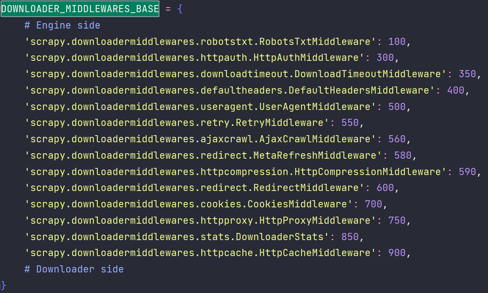

# Downloader Middleware

Request：
`Scheduler -> Engine --Downloader Middleware-->Downloader`
Response：
`Downloader --Downloader Middleware-->Engine->Spider`

Scrapy提供了许多内置的Downloader Middleware
如失败重试（RetryMiddleware）、自动重定向（RedirectMiddleware）等



键值代表调用的优先级，数字越小越靠近Engine

自定义下载中间件需要实现`process_request`、`process_response`、`process_exception`
然后在settings.py的`DOWNLOADER_MIDDLEWARES`字典中注册自定义下载中间件

键值较小的，`process_request`越早被调用
键值较大的，`process_response`越早被调用

* process_request(request, spider)

1. 返回None，Request继续传递给下一个中间件
2. 返回Response，掉头去调用前面中间件的process_response
3. 返回Request，该Request对象被重新放到调度队列

* process_response(request, response, spider)

1. 返回Request，该Request对象被重新放到调度队列
2. 返回Response，Response继续传递给下一个中间件

* process_exception

抛出异常时被执行

1. 返回None，继续传给下一个中间件的process_exception
2. 返回Response，传给下一个中间件的process_response
3. 返回Request，该Request对象被重新放到调度队列

eg1. 设置UA

```python
# middlewares.py
import random


class RandomUAMiddleware(object):
    def __init__(self):
        self.user_agents = [
            'User-Agent/A',
            'User-Agent/B',
            'User-Agent/C'
        ]

    def process_request(self, request, spider):
        request.headers['User-Agent'] = random.choice(self.user_agents)
```

> \# settings.py
>
> DOWNLOADER_MIDDLEWARES = {
>    'spider.middlewares.RandomUAMiddleware': 543,
> }

eg2. 设置代理

```python
class ProxyMiddleware(object):
    def process_request(self, request, spider):
        request.meta['proxy'] = 'http://127.0.0.1:8080'
```

