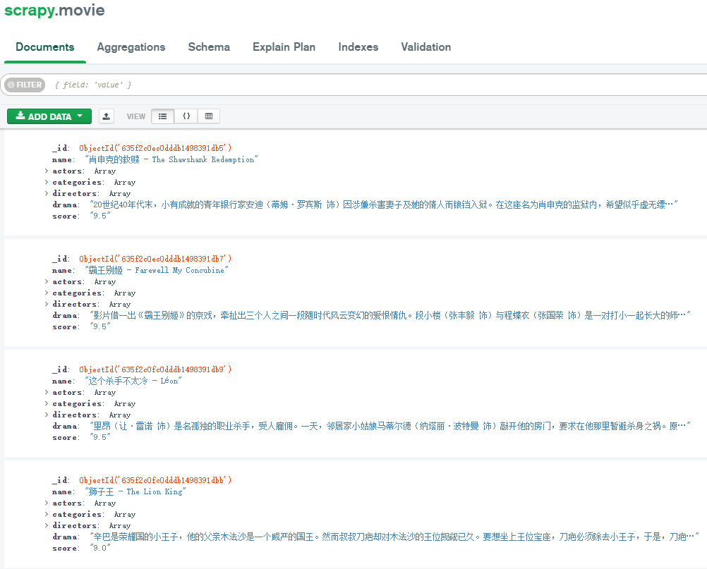

# Item Pipeline

Response：
Spider -> Engine -> Item Pipeline

Item Pipeline的主要功能

* 清洗HTML数据
* 检查爬取字段
* 查重丢弃重复内容
* 持久化存储

自定义Item Pipeline可以通过下面方法来扩展功能

* process_item(item, spider)

必须实现这个方法，默认使用该方法对Item进行处理，如进行数据处理或将数据写入数据库

返回Item对象或抛出DropItem异常

若返回Item对象，此Item会被低优先级的Item Pipeline处理

若抛出DropItem异常，此Item直接被抛弃

* open_spider(spider)

在Spider开启时被自动调用，可以做一些初始化操作，如开启数据库连接

* close_spider(spider)

在Spider关闭时被自动调用，可以做一些收尾操作，如关闭数据库连接

* from_crawler(cls, crawler)

是一个类方法，用@classmethod标识。通过crawler可以获取Scrapy的所有核心组件，如全局配置

参数cls就是Class，该方法返回一个Class实例

# 实战

🪁Target: https://ssr1.scrape.center/

:four_leaf_clover:Data Storage: MongoDB

```python
# ssr1.py
import scrapy
from scrapy import Request
from movie.items import MovieItem


class Ssr1Spider(scrapy.Spider):
    name = 'ssr1'
    allowed_domains = ['ssr1.scrape.center']
    start_url = 'http://ssr1.scrape.center'
    max_page = 10

    def start_requests(self):
        for i in range(1, self.max_page + 1):
            url = f'{self.start_url}/page/{i}'
            yield Request(url=url, callback=self.parse_index)

    def parse_index(self, response):
        for item in response.css('.item'):
            href = item.css('.name::attr(href)').extract_first()
            url = response.urljoin(href)
            yield Request(url=url, callback=self.parse_detail)

    def parse_detail(self, response):
        item = MovieItem()
        item['name'] = response.css('h2::text').extract_first()
        item['categories'] = response.css('.categories span::text').extract()
        item['score'] = response.css('.score::text').extract_first().strip()
        item['drama'] = response.css('.drama p::text').extract_first().strip()
        item['directors'] = response.css('.directors .name::text').extract()
        item['actors'] = response.css('.actors .name::text').extract()
        yield item
```

```python
# pipelines.py
import pymongo
class MongoDBPipeline(object):

    def __init__(self, connection, database, collection):
        self.connection = connection
        self.database = database
        self.collection = collection

    @classmethod
    def from_crawler(cls, crawler):
        return cls(connection=crawler.settings.get('MONGODB_CONNECTION_STRING'),
                   database=crawler.settings.get('MONGODB_DATABASE'),
                   collection=crawler.settings.get('MONGODB_COLLECTION')
                   )

    def open_spider(self, spider):
        self.client = pymongo.MongoClient(self.connection)
        self.db = self.client[self.database]

    def process_item(self, item, spider):
        self.db[self.collection].update_one({
            'name': item['name']
        }, {
            '$set': dict(item)
        }, True)
        return item

    def close_spider(self, spider):
        self.client.close()
```

```python
# settings.py
ITEM_PIPELINES = {
    'movie.pipelines.MongoDBPipeline': 300,
}
MONGODB_CONNECTION_STRING = 'localhost'
MONGODB_DATABASE = 'scrapy'
MONGODB_COLLECTION = 'movie'
```


