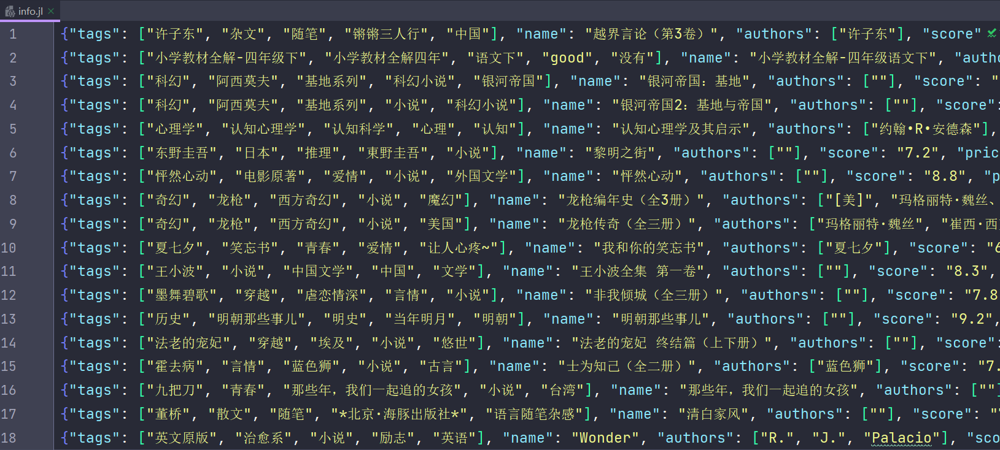

# Scrapy to Selenium

对接原理：

当Downloader Middleware的process_requests方法返回Response对象时，此时反转方向，调用之前中间件的process_response方法，调用完后将Response对象传给Spider处理。

所以我们的阻截点在Downloader Middleware的process_requests方法，在这个方法中获取Request对象的URL，然后使用selenium完成URL请求，返回经过JavaScript渲染后的HTML页面，即HtmlResponse对象。

# 实战

📌Target：https://spa5.scrape.center/

:wrench:Tool：Selenium

点进图书详情页，抓包可知页面是通过ajax动态渲染出来的

首先定义Item类

```python
import scrapy
from scrapy import Field


class BookItem(scrapy.Item):
    name = Field()
    authors = Field()
    score = Field()
    price = Field()
    tags = Field()
```

编写中间件
```python
import time
from selenium import webdriver
from selenium.webdriver import ChromeOptions
from scrapy.http import HtmlResponse


class SeleniumDownloaderMiddleware:

    def process_request(self, request, spider):
        option = ChromeOptions()
        option.add_argument('--headless') # 设置无头模式
        browser = webdriver.Chrome(options=option)
        browser.get(request.url)
        time.sleep(1)
        source = browser.page_source
        browser.close()
        return HtmlResponse(url=request.url,
                            body=source,
                            request=request,
                            encoding='utf-8',
                            status=200)
```

settings.py中注册中间件

```python
# settings.py
DOWNLOADER_MIDDLEWARES = {
   'book.middlewares.SeleniumDownloaderMiddleware': 543,
}
ROBOTSTXT_OBEY = False
```

编写Spider

```python
import scrapy
from scrapy import Request
from book.items import BookItem


class Spa5Spider(scrapy.Spider):
    name = 'spa5'
    allowed_domains = ['spa5.scrape.center']
    start_url = 'http://spa5.scrape.center'
    max_page = 1

    def start_requests(self):
        for i in range(1, self.max_page + 1):
            url = self.start_url + f'/page/{i}'
            yield Request(url=url, callback=self.parse_index)

    def parse_index(self, response):
        for url in response.css('.top a::attr(href)').extract():
            detail_url = self.start_url + url
            yield Request(url=detail_url, callback=self.parse_detail, priority=2)

    def parse_detail(self, response):
        book = BookItem()
        book['tags'] = []
        book['name'] = response.css('a h2::text').extract_first()
        book['authors'] = response.css('.authors::text').re_first('作者：(.*)').strip().split(' ')
        book['score'] = response.css('.score::text').extract_first().strip()
        book['price'] = response.css('.price span::text').extract_first()
        for tag in response.css('.tags span::text').extract():
            book['tags'].append(tag.strip())
        yield book
```



上面的SeleniumDownloaderMiddleware过于粗糙，如没有设置并发数，同一时刻只有一个页面可以被渲染，变成阻塞式爬取，爬取效率大大降低

崔佬写了个包 `pip install gerapy-selenium`

```python
# settings.py
DOWNLOADER_MIDDLEWARES = {
   'gerapy_selenium.downloadermiddlewares.SeleniumMiddleware': 543,
}
CONCURRENT_REQUEST = 6
```

```python
# spa5.py
def start_requests(self):
    for i in range(1, self.max_page + 1):
        url = self.start_url + f'/page/{i}'
        yield SeleniumRequest(url=url, callback=self.parse_index, wait_for='.top a')

        def parse_index(self, response):
            for url in response.css('.top a::attr(href)').extract():
                detail_url = self.start_url + url
                yield SeleniumRequest(url=detail_url, callback=self.parse_detail, priority=2)
```

