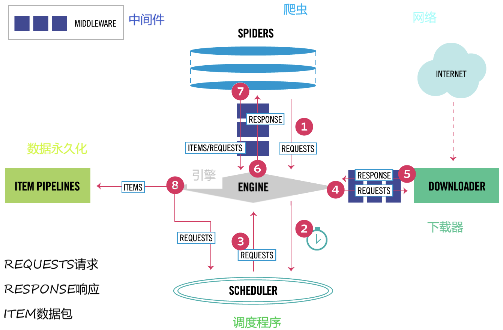
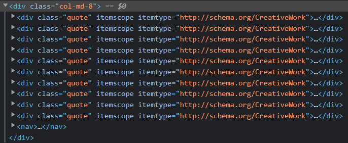
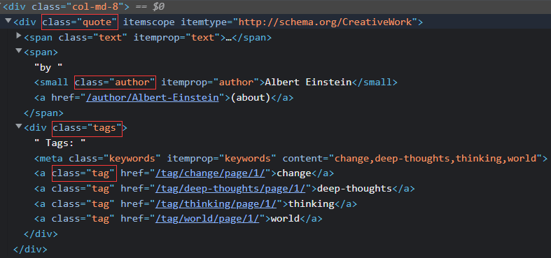
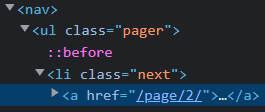
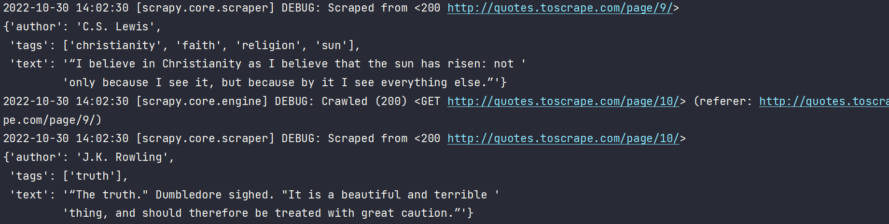
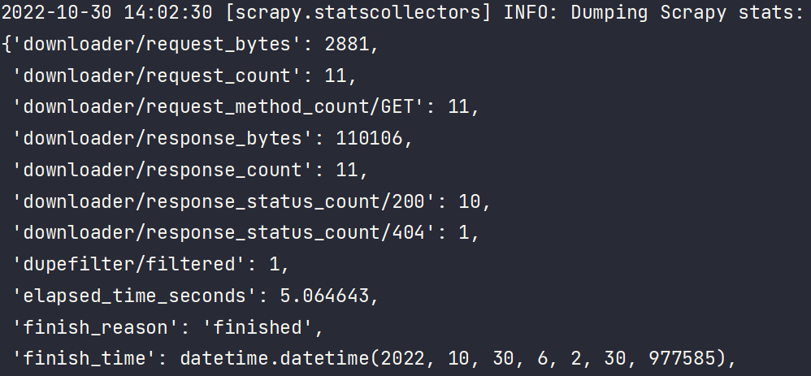
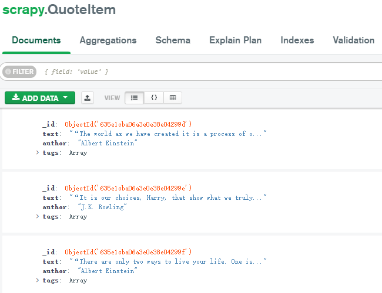

# 0x01 Scrapy Structure



* Engine：整个框架的中央处理器，负责数据流的转发和逻辑处理
* Item：爬取结果的数据结构
* Schedule：调度器，REQUEST的调度策略（维护了一个调度队列）
* Spiders：负责解析响应并生成Item，以及生成新请求REQUEST发送给Engine
* Downloader：获取响应
* Item Pipelines：处理由Spider生成的Item，如数据清洗、验证、存储
* Downloader Middlewares、Spider Middlewares：Hook框架，有点像java web的过滤器

上图中Engine负责数据流的转发，数据流主要包括Item、Request、Response

# 0x02 Project Framework

Scrapy提供了一些命令工具:kick_scooter:

* 创建爬虫项目

`scrapy startproject news`

* 创建Spider

`scrapy genspider taobao taobao.com`    genspider + Spider名称 + 域名

│  scrapy.cfg
│
└─news
    │  items.py
    │  middlewares.py
    │  pipelines.py
    │  settings.py
    │  __init__.py
    │
    └─spiders
      	│  taobao.py
      	│  __init__.py


# 0x03 Quick Start

🎯Target：`http://quotes.toscrape.com/`

:leaves:Data Storage：MongoDB

##### 1. Creat Project

```bash
scrapy startproject quickstart
cd quickstart
scrapy genspider quotes quotes.toscrape.com/
```

##### 2. Creat Spider

```python
# quotes.py
import scrapy
class QuotesSpider(scrapy.Spider):
    name = 'quotes'
    allowed_domains = ['quotes.toscrape.com']
    start_urls = ['http://quotes.toscrape.com/']

    def parse(self, response):
        pass
```

继承`scrapy.Spider`

* name：项目的唯一名字，用于区别不同的Spider
* allowed_domains：允许爬取的域名，不在此域名下的请求会被过滤
* start_urls：Spider启动时爬取的URL列表
* parse：解析返回的响应、生成新的请求
  （Response：Downloader --Downloader Middlewares--> Engine --Spider Middlewares--> Spider）

##### 3. Creat Item

自定义Item需要继承`scrapy.Item`，属性为Field类型

观察目标网站，需要爬取的字段有如下三个

```python
# items.py
import scrapy
class QuotesItem(scrapy.Item):
    text = scrapy.Field()
    author = scrapy.Field()
    tags = scrapy.Field()
```

##### 4. Resolve Response







改写parse方法

```python
def parse(self, response):
    # 直接借助response的css/xpath方法
    quotes = response.css('.quote')  # class为quote
    for quote in quotes:
        # 实际上quote.css()得到的是Selector对象的列表
        text = quote.css('.text::text').extract_first()
        author = quote.css('.author::text').extract_first()
        tags = quote.css('.tags .tag::text').extract()
```

##### 5. Generate Items

```python
def parse(self, response):
    quotes = response.css('.quote')
    for quote in quotes:
        item = QuoteItem()
        item['text'] = quote.css('.text::text').extract_first()
        item['author'] = quote.css('.author::text').extract_first()
        item['tags'] = quote.css('.tags .tag::text').extract()
        yield item
```

##### 6. Generate New Requests

Request类的构造方法接收两个参数

* url：目标页面的URL
* callback：Downloader下载后得到的Response要传递给一个回调方法，回调方法对Response进行解析生成Item/Request，如上文的parse就是一个回调方法

```python
next = response.css('.pager .next a::attr(href)').extract_first()
url = response.urljoin(next)  # 将相对URL构造成绝对URL
yield scrapy.Request(url=url, callback=self.parse)  # 回调方法依旧使用parse
```

```py
# urljoin演示
from urllib.parse import urljoin
print(urljoin('http://quotes.toscrape.com/', '/page/2'))
print(urljoin('http://quotes.toscrape.com/page/2', '/page/3'))
"""
http://quotes.toscrape.com/page/2
http://quotes.toscrape.com/page/3
"""
```

完整的Spider：

```python
import scrapy
from quickstart.items import QuoteItem


class QuotesSpider(scrapy.Spider):
    name = 'quotes'
    allowed_domains = ['quotes.toscrape.com']
    start_urls = ['http://quotes.toscrape.com/']

    def parse(self, response):
        quotes = response.css('.quote')
        for quote in quotes:
            item = QuoteItem()
            item['text'] = quote.css('.text::text').extract_first()
            item['author'] = quote.css('.author::text').extract_first()
            item['tags'] = quote.css('.tags .tag::text').extract()
            yield item
        next = response.css('.pager .next a::attr(href)').extract_first()
        url = response.urljoin(next)  # 将相对URL构造成绝对URL
        yield scrapy.Request(url=url, callback=self.parse)  # 回调方法依旧使用parse
```

##### 7. Run Project

`scrapy crawl quotes`   scrapy + crawl + Spider名称



输出了各个页面的爬取结果

最后输出了整个爬取过程的统计信息，如请求次数、请求字节数、完成时间等



##### 8. Persistent Storage

scrapy本身提供了保存爬取结果的工具——Feed Exports

`scrapy crawl quotes -o quotes.json`

Feed Exports支持很多格式，如jl、csv、xml、json、pickle、marshal

`jl`是`json lines`，每行都是一条json
若保存为json，则为json数组

##### 9. Use Item Pipeline

当Spider生成Item交给Engine后，Engine会把Item转发给Item Pipeline，其可以做如下操作

* 清洗数据
* 检查爬取的字段
* 查重并丢弃重复内容
* 持久化存储

自定义的pipeline需要添加到`ITEM_PIPELINES setting`

```python
# pipelines.py
from scrapy.exceptions import DropItem
# 对长度超过50的text进行截断
class TextPipeline(object):
    def __init__(self):
        self.limit = 50

    def process_item(self, item, spider):
        if item['text']:
            if len(item['text']) > self.limit:
                item['text'] = item['text'][0: self.limit].rstrip() + '...'
            return item
        else:
            return DropItem('Missing Text')
```

```python
# pipelines.py
import pymongo
class MongoDBPipeline(object):
    def __init__(self, con_string, database):
        self.con_string = con_string
        self.database = database

    @classmethod
    def from_crawler(cls, crawler):
        return cls(
            con_string=crawler.settings.get('MONGODB_CONNECTION_STRING'),
            database=crawler.settings.get('MONGODB_DATABASE')
        )

    def open_spider(self, spider):
        self.client = pymongo.MongoClient(self.con_string)
        self.db = self.client[self.database]

    def process_item(self, item, spider):
        name = item.__class__.__name__  # item类名
        self.db[name].insert(dict(item))
        return item

    def close_spider(self, spider):
        self.client.close()
```

MongoDBPipeline类实现了几个scrapy的API

* from_crawler：`@classmethod`可以理解为Java中的静态方法。通过crawler可以获取全局配置（settings.py）
* open_spider：Spider开启时自动调用
* close_spider：Spider关闭时自动调用

settings.py添加如下内容

> ITEM_PIPELINES = {
>    'quickstart.pipelines.TextPipeline': 300,
>    'quickstart.pipelines.MongoDBPipeline': 400,
> }
>
> MONGODB_CONNECTION_STRING = 'localhost'
> MONGODB_DATABASE = 'scrapy'

ITEM_PIPELINES 字典注册了自定义的Pipeline，键值是调用优先级，数字越小越先被调用

重新运行`scrapy crawl quotes`，可以看到MongoDB创建了scrapy数据库和QuoteItem表

