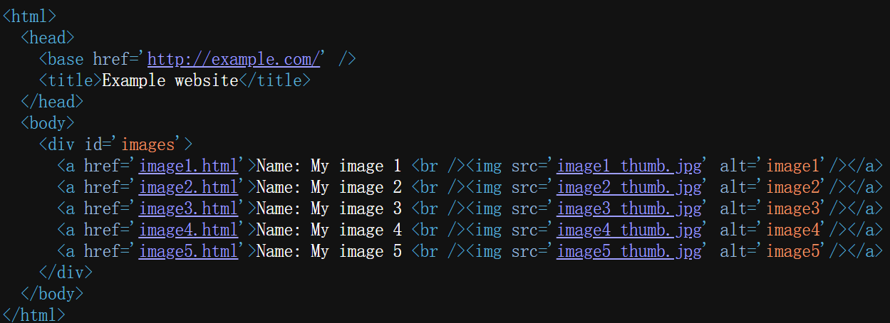
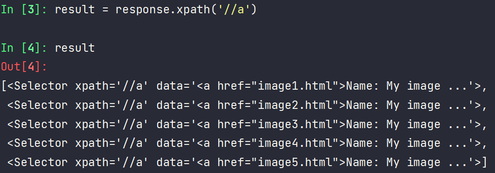
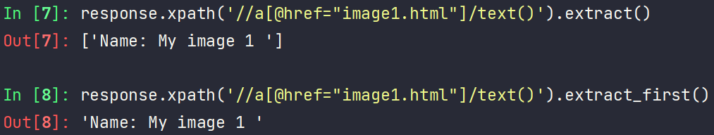
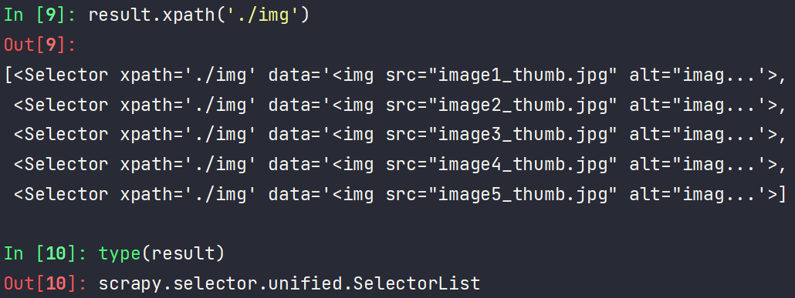
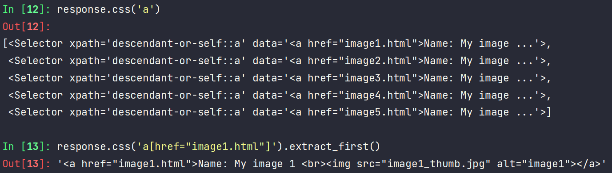
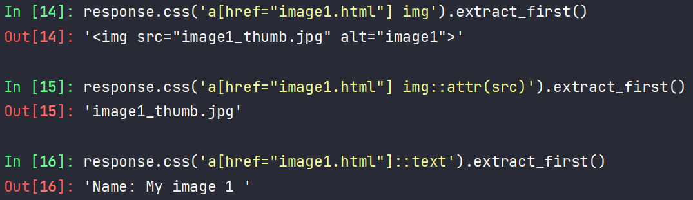
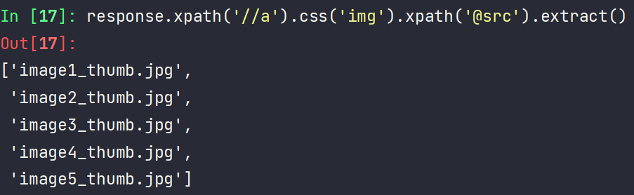
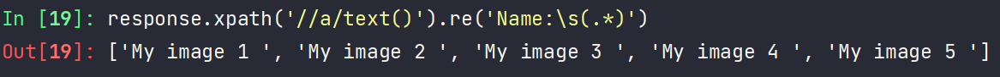
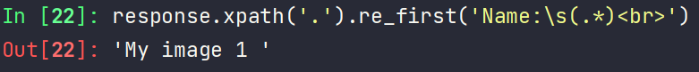

# :bookmark:Selector Usage

Scrapy提供了一个独立的模块Selector，用于解析html数据。

```py
from scrapy import Selector
body = "<html><body><p>Hello Selector</p></body></html>"
selector = Selector(text=body)
p = selector.xpath('//p/text()').extract_first()
print(p)  # Hello Selector
```

在scrapy中，回调函数中可以使用Selector来对参数response解析

下面用Scrapy shell进行演示（交互测试）

`scrapy shell https://docs.scrapy.org/en/latest/_static/selectors-sample1.html`



# XPath Selector







注意这里`result.xpath('./img')`前面的点表示提取元素内部的数据`./img`

只要是`SelectorList`或`Selector`类型，就能继续用`.xpath()`或`.css()`

# CSS Selector





获取文本`::text`
获取属性`::attr`

css还可以和xpath嵌套使用


# Regex



注意：response不能直接调用re方法，需要先调用xpath或css



