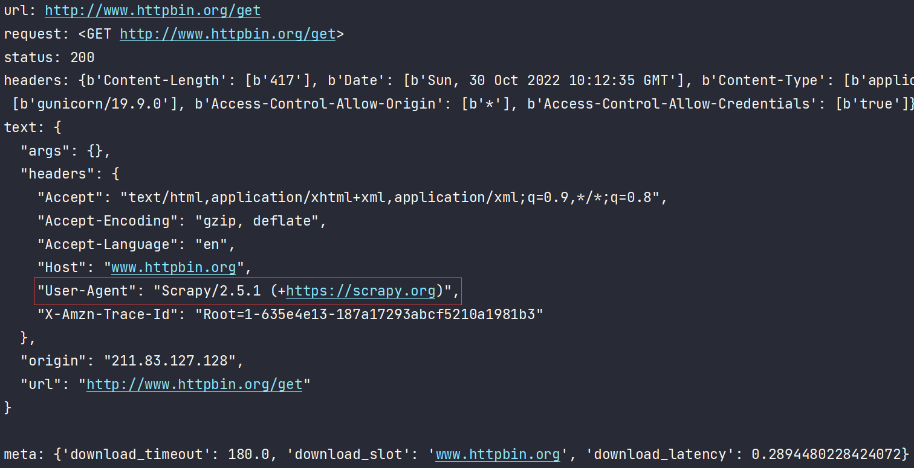
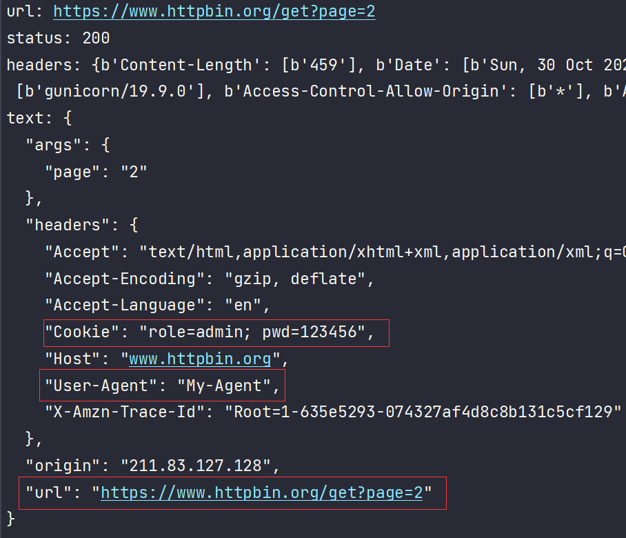

# :spider:Spider Usage

Spider类

属性：

* name
* allowed_domains
* start_urls
* crawler
* settings

方法：

* start_requests
* parse
* closed

建立一个新的Scrapy项目
```python
import scrapy
class HttpbinSpider(scrapy.Spider):
    name = 'httpbin'
    allowed_domains = ['www.httpbin.org']
    start_urls = ['http://www.httpbin.org/get']

    def parse(self, response):
        print('url:', response.url)
        print('request:', response.request)
        print('status:', response.status)
        print('headers:', response.headers)
        print('text:', response.text)
        print('meta:', response.meta)
```



我们并没有显示声明初始请求
其实是Spider默认实现了一个start_requests方法

```python
def start_requests(self):
    cls = self.__class__
    if not self.start_urls and hasattr(self, 'start_url'):
        raise AttributeError(
            "Crawling could not start: 'start_urls' not found "
            "or empty (but found 'start_url' attribute instead, "
            "did you miss an 's'?)")
    for url in self.start_urls:
        yield Request(url, dont_filter=True)
```

这边实例化的Request也没有指定callback，默认是parse方法

可以重写`start_requests`来自定义初始请求

#### :triangular_flag_on_post:GET

```python
import scrapy
from scrapy import Request


class HttpbinSpider(scrapy.Spider):
    name = 'httpbin'
    allowed_domains = ['www.httpbin.org']
    start_url = 'https://www.httpbin.org/get'
    headers = {
        'User-Agent': 'My-Agent'
    }
    cookies = {
        "role": 'admin',
        "pwd": '123456'  # 注意这里不能写123456
    }

    def start_requests(self):
        for page in range(5):
            url = self.start_url + f'?page={page + 1}'
            yield Request(url=url,
                          headers=self.headers,
                          cookies=self.cookies,
                          callback=self.parse_res)

    def parse_res(self, response):
        print('url:', response.url)
        print('status:', response.status)
        print('headers:', response.headers)
        print('text:', response.text)
```



#### :triangular_flag_on_post:POST

可以以Form Data或Json的格式发送POST请求，对应FormRequest、JsonRequest

对应请求头Content-Type
一个application/x-www-form-urlencoded
一个application/json

```python
import scrapy
from scrapy import FormRequest
from scrapy.http.request.json_request import JsonRequest


class HttpbinSpider(scrapy.Spider):
    name = 'httpbin'
    allowed_domains = ['www.httpbin.org']
    start_url = 'https://www.httpbin.org/post'
    data = {
        "role": 'admin',
        "pwd": '123456'
    }

    def start_requests(self):
        # 注意一个是formdata、一个是data
        yield FormRequest(self.start_url,
                          callback=self.parse_res,
                          formdata=self.data)
        yield JsonRequest(self.start_url,
                          callback=self.parse_res,
                          data=self.data)

    def parse_res(self, response):
        print('text:', response.text)
```

